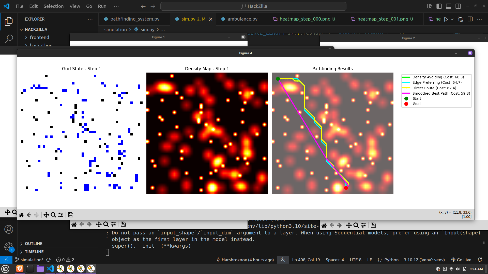

# Crowd Predictor
This app uses many techniques and algorithms to predict future crowd patterns in a large gathering and provide details about where can emergency personnel like police and ambluance should be stationed for maximum efficiency. It also provides the shortest and the most efficient path through the crowd and obstacles.

## Tech Stack
- `Python`
- `Numpy`
- `Tensorflow`
- `Scikit-Learn`
- `Matplotlib`
- `CV2`
- `React`
- `Vite`

## Crowd Simulation with Heatmaps - Gaussian filter
Crowd movement simulation using python numpy and plotting those movement with the help of matplotlib where the blue dots represent the people and the black dots represent the obstacles such as vehicles, walls etc. The crowd is represented internally with the use of 2D Array. `Cumulative heatmap` generation using `gaussian filter` where the less dense areas are represented in black and more densely populated areas are represented by bright red.  

## Future Crowd - LSTM
Implemented future crowd predicition using the `LSTM` model due to crowd movement being a time series feature.  
  
Accuracy of LSTM model is shown below :-  

## Shortest Pathfinding - A* Algorithm
Implemented shortest pathfinding algorithm using A*. It finds for us paths that avoid the obstacles and heavy crowds.  

## Ambulance Distribution - DBSCAN Clustering
Implemented the distribution of emergency services using DBSCAN clustering algorithm so that the ambulances are distributed according to the density. More units in higher density areas and vice versa.  

